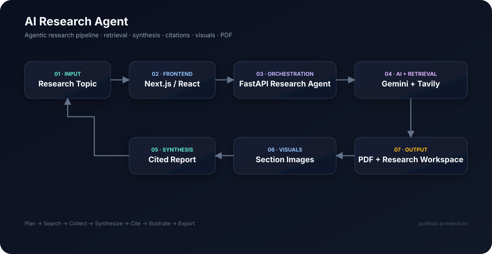
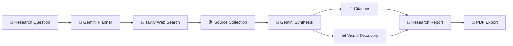

<div align="center">

# 🧠⚡ AI RESEARCH AGENT

### Turn one question into a structured, citation-backed research report.

**Search the web. Gather evidence. Reason over sources. Generate the report. Export it.**

<p>
  <a href="https://ai-research-agent-nine-steel.vercel.app"></a>
  <a href="https://github.com/Priyanshu710-ui/AI-Research-Agent"></a>
</p>

<p>
  
  
  
  
  
</p>

<p>
  
  
  
</p>

> **Research less. Understand more.**

</div>

---

## 🔥 The Idea

Most AI assistants answer questions.

**This one researches them.**

AI Research Agent is a full-stack, agentic research workspace that transforms a natural-language question into a polished, source-backed report.

Instead of manually opening tabs, reading articles, collecting evidence, organizing notes, finding visuals, writing a report, and exporting it—you give the agent a topic and let the workflow do the heavy lifting.

```text
QUESTION
   ↓
PLAN
   ↓
SEARCH
   ↓
COLLECT
   ↓
SYNTHESIZE
   ↓
CITE
   ↓
ILLUSTRATE
   ↓
EXPORT
```

This isn't just **"ChatGPT + search."**

It's an **end-to-end research pipeline** designed around evidence discovery, source-aware synthesis, and usable output.

---

## 🚀 Live Product

<div align="center">

### [🌐 Launch AI Research Agent](https://ai-research-agent-nine-steel.vercel.app)

**Frontend:** Vercel  •  **Backend:** Render  •  **AI:** Gemini  •  **Search:** Tavily

</div>

---

## ✨ What Makes It Different?

| Capability | What happens |
|---|---|
| 🧠 **Research Planning** | Gemini breaks a broad question into focused research directions. |
| 🔎 **Web Discovery** | Tavily finds relevant web sources instead of relying only on model memory. |
| 📚 **Evidence Collection** | Search results are gathered and organized before synthesis. |
| ✍️ **AI Synthesis** | The model converts discovered evidence into a structured report. |
| 🔗 **Citations** | Report sections stay connected to supporting sources. |
| 🖼️ **Visual Research** | Relevant imagery can be discovered for report sections. |
| 📄 **PDF Export** | Turn the generated research into a shareable document. |
| ⚡ **Modern UI** | Fast, responsive Next.js interface for the full workflow. |
| 🐳 **Docker Support** | Run the complete stack consistently across environments. |
| ☁️ **Cloud Ready** | Frontend and backend are structured for deployment. |

---

## 🧬 Architecture

<p align="center">
  
</p>

### System Flow



---

## 🎯 The Workflow

### 01 — Ask

Enter something as broad as:

> **"How will generative AI change software engineering over the next decade?"**

### 02 — Plan

Gemini transforms the question into focused search directions so the system can investigate the topic instead of making one giant search request.

### 03 — Search

Tavily discovers relevant sources from the web.

### 04 — Collect

Sources and findings are gathered into the research context.

### 05 — Synthesize

Gemini turns the collected evidence into a readable, structured report.

### 06 — Cite

The final report keeps source links close to the relevant research findings.

### 07 — Illustrate

Relevant visuals can be discovered to make the final report easier to understand.

### 08 — Export

Generate a polished PDF and take the research with you.

---

## 🧪 Example Research Flow

```text
Input
└── "Impact of AI on software engineering"

Research Plan
├── AI-assisted development
├── Developer productivity
├── Code generation
├── AI software testing
└── Future engineering roles

Evidence
├── Web sources
├── Articles
├── Research material
└── Supporting visuals

Output
├── Executive overview
├── Structured sections
├── Source-backed findings
├── References
└── Exportable PDF
```

---

## 🛠️ Technology Stack

| Layer | Technology |
|---|---|
| Frontend | **Next.js · React · Tailwind CSS** |
| Backend | **FastAPI · Python** |
| AI | **Google Gemini** |
| Web + Image Search | **Tavily** |
| Containers | **Docker · Docker Compose** |
| Deployment | **Vercel · Render** |

---

## 🗂️ Project Structure

```text
AI-Research-Agent/
│
├── backend/
│   ├── agent.py             # Agentic research workflow
│   ├── main.py              # FastAPI application
│   ├── requirements.txt     # Backend dependencies
│   └── Dockerfile
│
├── frontend/
│   ├── pages/               # Next.js application pages
│   ├── styles/              # Frontend styling
│   ├── package.json
│   └── Dockerfile
│
├── docs/
│   └── architecture.svg    # Architecture diagram
│
├── .env.example
├── .gitignore
├── docker-compose.yml
├── CONTRIBUTING.md
├── SECURITY.md
└── README.md
```

---

## ⚡ Run It Locally

### Prerequisites

- Python 3.x
- Node.js + npm
- Docker (optional)
- Gemini API key
- Tavily API key

### 🔐 Environment Setup

```bash
cp .env.example .env
```

Add your keys:

```env
GEMINI_API_KEY=your_gemini_api_key_here
TAVILY_API_KEY=your_tavily_api_key_here
```

> 🚨 **Never commit real API keys to GitHub.**

### 🐳 Docker Compose

```bash
docker compose up --build
```

Open:

```text
Frontend  → http://localhost:3000
Backend   → http://localhost:8000
API Docs  → http://localhost:8000/docs
```

### 💻 Run Services Separately

#### Backend

```bash
cd backend
python -m venv venv
```

**Windows**

```bash
venv\Scripts\activate
```

**macOS / Linux**

```bash
source venv/bin/activate
```

```bash
pip install -r requirements.txt
uvicorn main:app --reload
```

#### Frontend

```bash
cd frontend
npm install
npm run dev
```

Then visit:

```text
http://localhost:3000
```

---

## 🔌 API

### `POST /research`

Starts the research workflow for a topic.

#### Request

```json
{
  "topic": "Impact of artificial intelligence on software engineering"
}
```

#### Pipeline

```text
POST /research
     ↓
Research Planning
     ↓
Web Retrieval
     ↓
Evidence Collection
     ↓
AI Synthesis
     ↓
Structured Research Output
```

Interactive API documentation:

```text
http://localhost:8000/docs
```

---

## ☁️ Deployment

### Frontend — Vercel

🚀 **Live:** https://ai-research-agent-nine-steel.vercel.app

### Backend — Render

⚙️ **API:** https://ai-research-agent-li2u.onrender.com

Configure the backend with:

```text
GEMINI_API_KEY
TAVILY_API_KEY
```

Configure the frontend to use the deployed backend URL in its production API configuration.

---

## 🔒 Security Notes

For production deployments:

- Keep secrets server-side.
- Never commit `.env` files.
- Restrict CORS to trusted origins.
- Add authentication before exposing sensitive endpoints publicly.
- Add rate limiting and request quotas.
- Add structured logging and monitoring.
- Validate and sanitize external source data.

See **[SECURITY.md](SECURITY.md)** for the security policy.

---

## 📈 Why This Is a Serious Portfolio Project

AI Research Agent demonstrates a complete product rather than a single AI prompt.

```text
LLM Reasoning
      +
Web Retrieval
      +
Source-Aware Synthesis
      +
Visual Research
      +
Backend APIs
      +
Modern Frontend
      +
PDF Generation
      +
Docker
      +
Cloud Deployment
```

It showcases **AI engineering, backend development, frontend development, retrieval, workflow design, API integration, DevOps, and product thinking** in one project.

---

## 🗺️ Roadmap

### ✅ Completed

- [x] Agentic web research pipeline
- [x] Gemini research planning
- [x] Tavily web discovery
- [x] Structured report synthesis
- [x] Source citations
- [x] Section-specific visuals
- [x] PDF export
- [x] Docker support
- [x] Vercel deployment
- [x] Render backend deployment

### 🚀 Next Level

- [ ] Streaming research progress
- [ ] Saved research projects
- [ ] Research history
- [ ] Source-quality scoring
- [ ] Source credibility ranking
- [ ] Multi-agent research teams
- [ ] Long-term research memory
- [ ] Research comparison mode
- [ ] User authentication
- [ ] Analytics + observability

---

## 🤝 Contributing

Contributions are welcome—bug fixes, UI improvements, research-quality improvements, optimizations, documentation, and security enhancements.

See **[CONTRIBUTING.md](CONTRIBUTING.md)** for the contribution workflow.

---

## 🧑‍💻 Built By

<div align="center">

### **Priyanshu Sharma**

Built to explore what happens when **LLMs + real web evidence + agentic workflows + full-stack engineering** come together in one product.

<a href="https://github.com/Priyanshu710-ui">GitHub</a>

</div>

---

## ⭐ Support the Project

If you found this project useful, interesting, or just ridiculously cool:

### **⭐ Star the repository.**

It helps the project get noticed and motivates future improvements.

<div align="center">

## 🧠 Search. Reason. Verify. Create.

### **AI Research Agent**

*Research less. Understand more.*

<a href="https://ai-research-agent-nine-steel.vercel.app"><strong>🚀 TRY THE LIVE APP →</strong></a>

</div>
