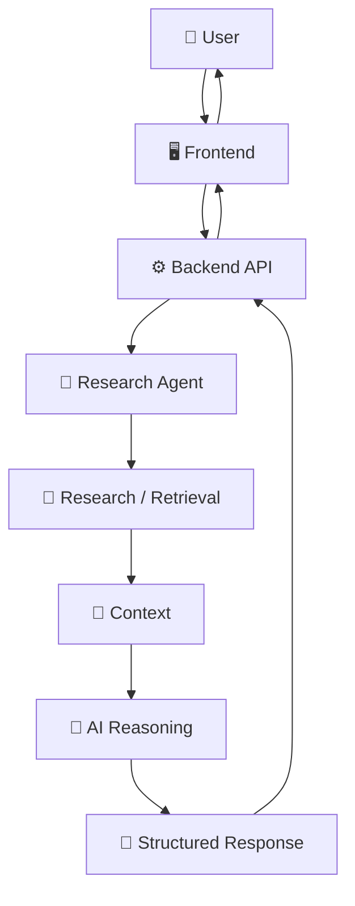
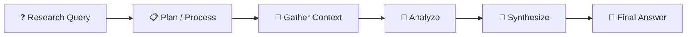
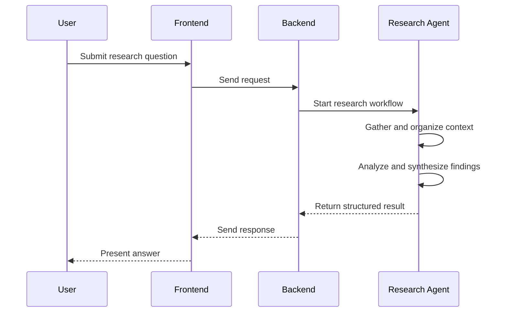
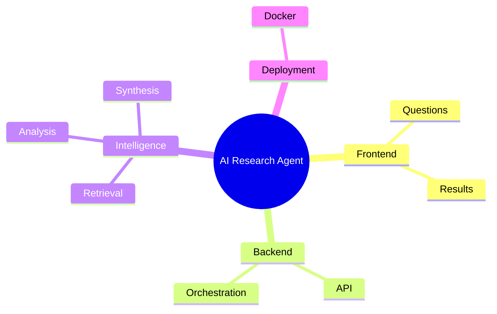

# 🔬 AI Research Agent

<p align="center"><b>An AI-powered research workflow that turns a question into a structured, synthesized response through dedicated frontend and backend layers.</b></p>

<p align="center">


</p>

---

## 🧠 What is AI Research Agent?

**AI Research Agent** is structured around a simple goal: help transform a research question into a more useful answer by coordinating a user interface, backend service, research workflow, and AI reasoning layer.

Instead of treating a question as a single isolated prompt, the project models a pipeline in which information is gathered or retrieved, relevant context is processed, and the result is synthesized into a structured response.

## ✨ Core Features

- ❓ Research-question driven workflow
- 🖥️ Dedicated frontend layer
- ⚙️ Backend/API layer
- 🤖 AI-agent style orchestration
- 🔎 Research and retrieval stage
- 🧩 Context analysis and synthesis
- 🐳 Docker-based project configuration

## 🏗️ System Architecture



## 🔬 Research Intelligence Pipeline



## 🔄 Execution Flow



## ⚙️ How It Works

1. The user enters a research question in the frontend.
2. The frontend sends the request to the backend.
3. The backend invokes the research workflow.
4. The agent gathers and processes relevant context.
5. AI reasoning synthesizes the information into a structured result.
6. The response is returned through the backend and displayed to the user.

## 📂 Project Structure

```text
AI-Research-Agent/
├── frontend/              # User-facing application
├── backend/               # API / server logic
├── docs/                  # Project documentation
├── docker-compose.yml     # Container configuration
└── .env.example           # Environment variable template
```

## 🛠️ Tech Stack

| Area | Role |
|---|---|
| Frontend | User interaction |
| Backend | Request handling and orchestration |
| AI Agent | Research workflow and reasoning |
| Docker | Reproducible environment setup |
| Environment Config | Configurable service settings |

## 🚀 Getting Started

Use the repository's environment template and dependency/configuration files to configure the frontend and backend. For container-based execution, the included Docker configuration provides the project structure needed to run the connected services.

```bash
git clone https://github.com/Priyanshu710-ui/AI-Research-Agent.git
cd AI-Research-Agent
```

Then configure environment variables based on `.env.example` and follow the backend/frontend dependency setup present in the repository.

## 🎯 Use Cases

- 📚 Research assistance
- 🧠 Topic exploration
- 📝 Structured information synthesis
- 🔎 Faster context gathering
- 💻 Demonstrating multi-layer AI application architecture

## 🗺️ Project Map



## 🔮 Roadmap

- [ ] Add source management and citations
- [ ] Add research history
- [ ] Add richer multi-step planning
- [ ] Add exportable reports
- [ ] Add evaluation and response-quality checks

---

### 👨‍💻 Created by **Priyanshu**

⭐ Star the project if you like the idea!
