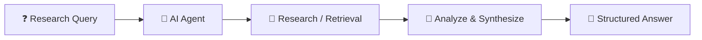
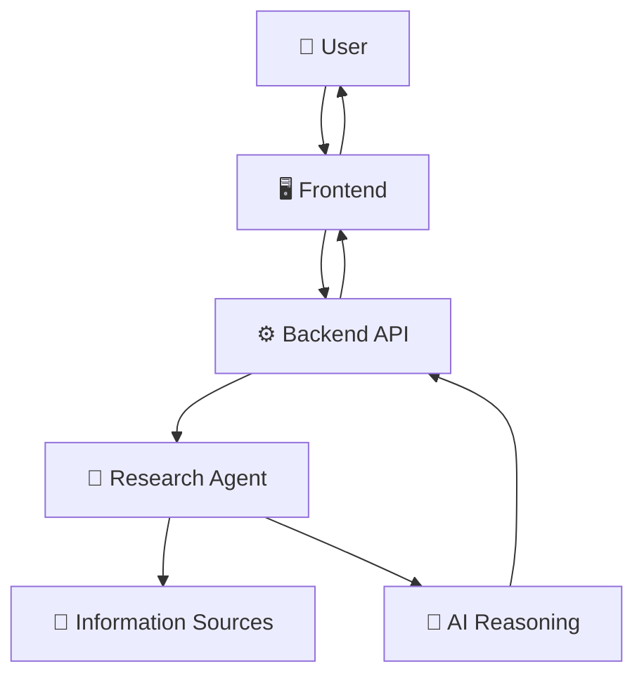
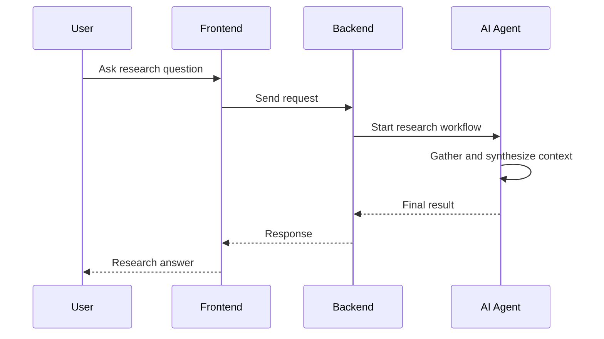
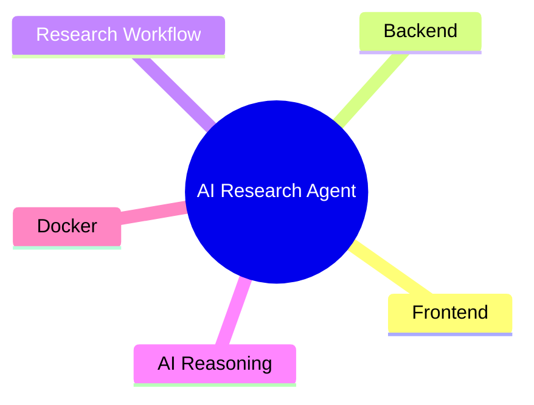

# 🔬 AI Research Agent

> An AI-powered research workflow with dedicated frontend and backend layers.


## 🧠 Research Intelligence Pipeline


## 🏗️ System Architecture


## 🔄 Agent Execution


## 🗺️ Project Map


## 📂 Blueprint
```text
├── frontend/
├── backend/
├── docs/
├── docker-compose.yml
└── .env.example
```

---

### 👨‍💻 Created by **Priyanshu**
